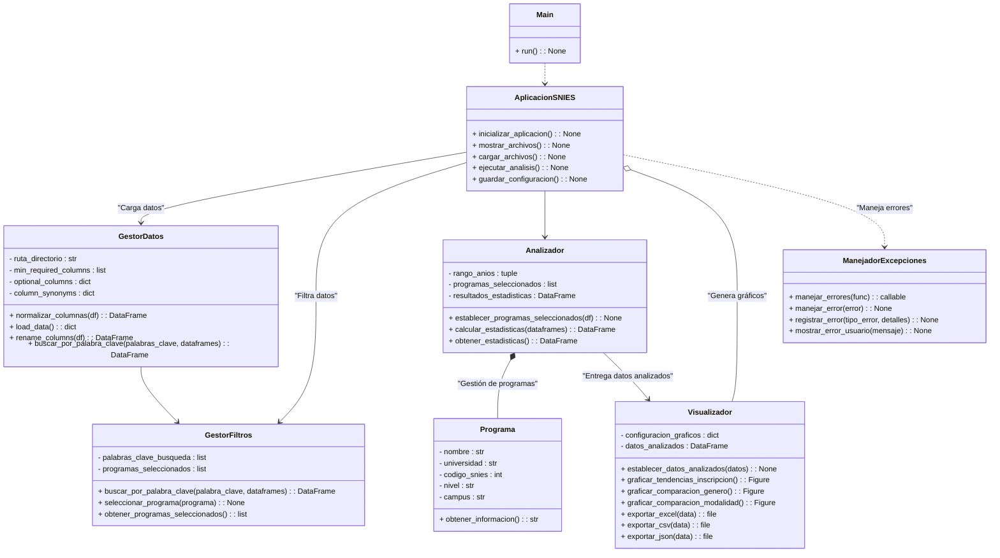

# **Sistema SNIES - Análisis de Programas Académicos**

## **Descripción General**
Este sistema permite la carga, filtrado y análisis de datos de programas académicos de instituciones educativas con base en los datos del SNIES. Se ha desarrollado utilizando **Python** y **Streamlit**.

### **Características Principales**
1. **Carga de Archivos**:
   - Soporta múltiples archivos Excel.
   - Valida columnas mínimas requeridas para el análisis.
   - Renombra automáticamente las columnas utilizando un diccionario de sinónimos.
2. **Filtrado de Programas Académicos**:
   - Búsqueda por palabras clave (soporta múltiples palabras).
   - Resultados detallados con información relevante del programa.
3. **Selección y Análisis**:
   - Selección interactiva de programas desde los resultados.
   - Generación de estadísticas personalizadas.
   - Exportación de resultados en formatos `.xlsx`, `.csv` y `.json`.

---
## **Estructura del Proyecto**
| Archivo               | Descripción                                              |
|-----------------------|----------------------------------------------------------|
| `app.py`              | Interfaz principal del sistema con Streamlit.            |
| `gestor_datos.py`     | Manejo de datos: carga, validación y procesamiento.       |
| `analizador.py`       | Generación de estadísticas a partir de los datos.        |
| `visualizador.py`     | Visualización de datos: gráficos y tablas.               |
| `manejador_excepciones.py` | Decorador para el manejo de errores en tiempo de ejecución.|

### **Estructura de Carpetas**
```plaintext
proyecto-snies/
├── inputs/                  # Archivos Excel de entrada
├── outputs/                 # Resultados generados (descargables)
├── app.py                   # Archivo principal
├── gestor_datos.py          # Manejo de datos
├── analizador.py            # Lógica para análisis
├── visualizador.py          # Generación de visualizaciones
├── manejador_excepciones.py # Manejo de errores
├── README.md                # Manual técnico
```


### **Diagrama UML**

